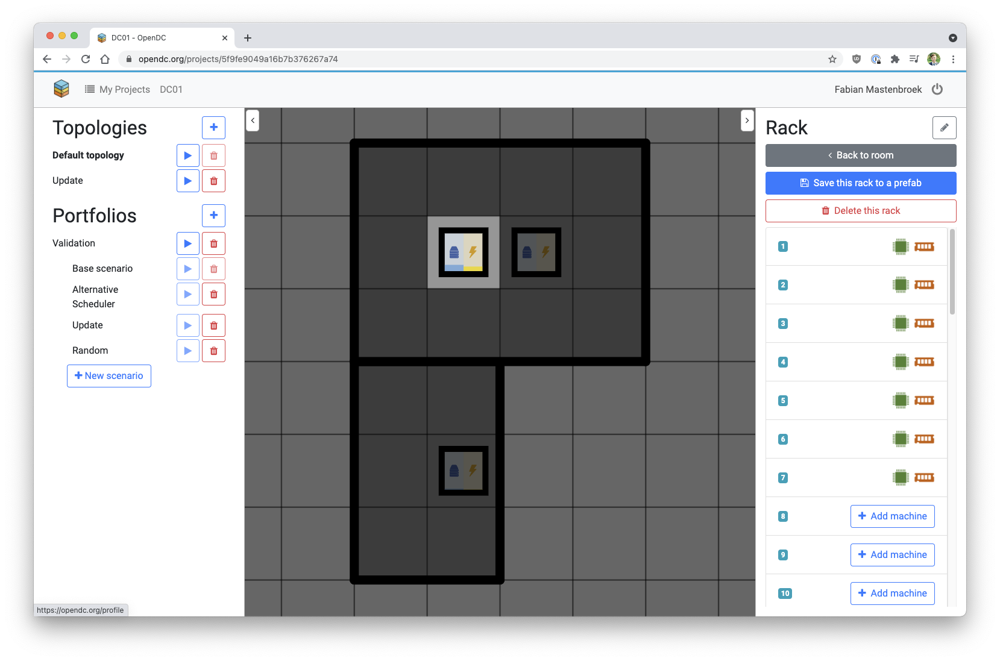
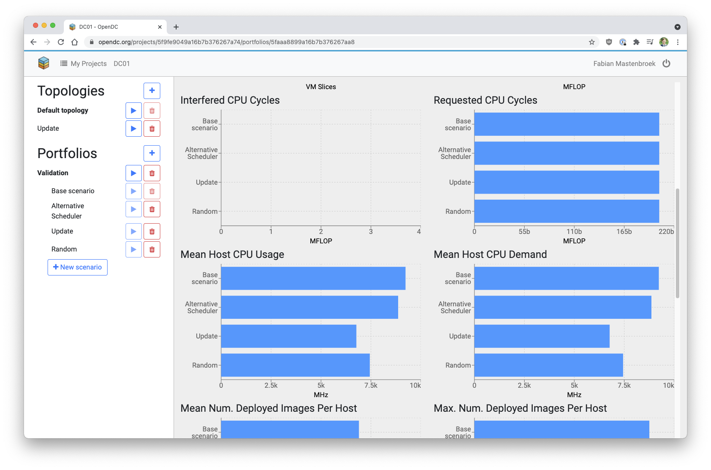

# Introduction

OpenDC is a free and open-source platform for datacenter simulation aimed at both research and education.

Users can construct datacenters (see above) and define portfolios of scenarios (experiments) to see how these
datacenters perform under different workloads and schedulers (see below).

The simulator is accessible both as a ready-to-use website hosted by us at [opendc.org](https://opendc.org), and as
source code that users can run locally on their own machine, through Docker.

To learn more
about OpenDC, have a look through our paper [OpenDC 2.0](https://atlarge-research.com/pdfs/ccgrid21-opendc-paper.pdf)
or on our [vision](https://atlarge-research.com/pdfs/opendc-vision17ispdc_cr.pdf).

🛠 OpenDC is a project by the [@Large Research Group](https://atlarge-research.com).

🐟 OpenDC comes bundled
with [Capelin](https://repository.tudelft.nl/islandora/object/uuid:d6d50861-86a3-4dd3-a13f-42d84db7af66?collection=education)
, the capacity planning tool for cloud datacenters based on portfolios of what-if scenarios. More information on how to
use and extend Capelin coming soon!

## Contributing

Questions, suggestions and contributions are welcome and appreciated!
Please refer to the [contributing guidelines](../community/contributing) for more details.

## License

OpenDC is distributed under the MIT license. See [LICENSE.txt](https://github.com/atlarge-research/opendc/tree/master/LICENSE.txt).
