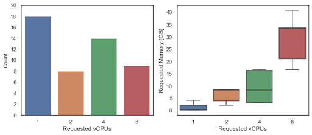
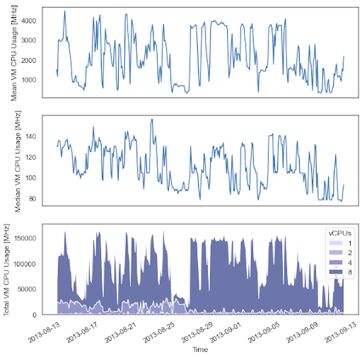

# Cloud Capacity Planning Tutorial
Using OpenDC to build and understand cloud systems.

:::info Learning goal

By doing this assignment, you will learn more about the basic concepts of datacenters, cloud computing, 
and big data as modern distributed systems technologies.
:::

## Preamble
Datacenter infrastructure is important in today’s digital society. Stakeholders across industry, government, and 
academia employ a vast and diverse array of cloud services hosted by datacenter infrastructure, and expect services to 
be reliable, high speed, and low cost. In turn, datacenter operators must maintain efficient operation at unprecedented scale.

To keep up with growing demand and increasing complexity, architects of datacenters must address complex challenges in
distributed systems, software engineering and performance engineering. One of these challenges is efficient utilization
of resources in datacenters, which is only 6-12% industry-wide despite the fact that it is inconvenient for datacenter 
operators to keep much of their infrastructure idle, due to resulting high energy consumption and thus unnecessary costs.

It is often quite difficult to implement optimizations or other changes in datacenters. Datacenter operators tend to be
conservative in adopting such changes in fear of failure or misbehaving systems. Furthermore, testing changes at the
scale of modern datacenter infrastructure in a real-world setting is prohibitively expensive and hard to reproduce, 
notwithstanding environmental concerns.

A more viable alternative is the use of datacenter simulators such as OpenDC or CloudSim. These tools model datacenter
infrastructure at a good accuracy and allow us to test changes in a controllable and repeatable environment.

In this tutorial, we will use the OpenDC datacenter simulator to experiment with datacenters and demonstrate the
process of designing and optimizing datacenters using simulation.

## What is OpenDC
OpenDC is an open source platform for datacenter simulation developed by AtLarge Research. The purpose of OpenDC is 
twofold: we aim to both enable cloud computing education and support research into datacenters. 
An example of the former is this tutorial, and examples of the latter include the numerous BSc and MSc research projects
that are using OpenDC to run experiments and perform research.

:::caution

OpenDC is still an experimental tool. Your data may get lost, overwritten, or otherwise become unavailable. Sorry for the inconvenience.

:::

## Setting up OpenDC

:::note Action

Create a new account on OpenDC and a project.

:::

An important design goal of OpenDC is to be easily accessible for users. One of the ways we have tried to achieve this
with, is by not requiring installation and instead a browser-first experience for users that want to explore and experiment with datacenters.

To get started quickly, we will use the online version of OpenDC available at https://opendc.org. 
If you prefer a local installation, see the [installation instructions](../getting-started/installation).
Once you are on the website, click on ‘Sign in’ and create a new account or authorize your Google account to be used
with our application. You’re now on the ‘Projects’ page. Here, you can see all datacenter simulation projects that you 
have created or that were shared with you.

Click on ‘+ New Project’ in the lower right corner to open the creation dialog.
Give your project a name and save it. You can now open it by clicking on it in the project table. If all went well, 
you’re redirected to your new project, and are presented with an empty canvas.

## How does OpenDC work?

OpenDC is built around three major concepts: topologies, portfolios and scenarios.

A **topology** is the physical layout of a datacenter. It specifies everything from the architectural layout of the 
datacenter’s rooms to which CPUs are in a particular machine.

A **portfolio** is an abstraction that is composed of a base scenario, a set of candidate scenarios given by the user 
and a set of targets (e.g. metrics) used to compare scenarios.

A **scenario** represents a point in the datacenter design space that should be explored. It consists of a combination
of workload, topology, and a set of operational phenomena. 
Phenomena can include correlated failures, performance variability, security breaches, etc., allowing the scenarios to
more accurately capture the real-world operations.

### Terminology

Here’s an overview of some of the language you’ll find in OpenDC:

- **Topology**: the physical layout of your datacenter
    * **Room**: a room in the datacenter
    * **Tile**: one of the tiles that forms a room
    * **Rack**: a rack of servers that stands on top of a tile
    * **Machine**: a machine that takes up a single slot in a server rack, containing several components such as CPUs, GPUs, networking cards and storage drives.
- **Workload**: the virtual machines that run in your datacenter
- **Workload Trace**: A dataset that characterizes the historical runtime behavior of the virtual machines in the workload over time.
- **Scheduler**: the algorithm that decides what virtual machine to run on what machines
- **Portfolio**: a base scenario, a set of candidate scenarios given by the user and a set of targets (e.g. metrics) used to compare scenarios.
- **Scenario**: the combination of workload, topology and operational phenomena, which the datacenter operator is interested in.

## Assignment

Acme Inc. is a small datacenter operator in the Netherlands. They are currently in the process of acquiring a new client
and closing a deal where Acme will migrate all of the client’s business-critical workloads from internal machines to
Acme’s datacenters. With this deal, the client aims to outsource the maintenance of their digital infrastructure, but in
turn expects reliable and efficient operation from Acme.

To demonstrate that Acme is capable of this task, it has started a pilot project with the client where Acme will migrate
already a small subset of the client’s workloads. You are an engineer at Acme. and have been tasked with the design and
procurement of the datacenter infrastructure required for this pilot project.

To guide your design, the client has provided a workload trace of their business-critical workloads, which consist of
the historical runtime behavior of 50 virtual machines over time. These virtual machines differ in resource
requirements (e.g. number of vCPUs or memory) and in resource consumption over time. We can use OpenDC to simulate this
workload trace and validate your datacenter design.

The assignment is divided into four parts:
1. Analyzing the requirements to estimate what resources are needed.
2. Building your design in OpenDC
3. Validating your design in OpenDC
4. Optimizing your design in OpenDC

Make notes of your thoughts on the following assignments & questions and discuss with your partner(s).

## Analyze the Requirements

The first step of the assignment is to analyze the requirements of the client in order to come up with a reasonable
estimation of the datacenter infrastructure needed. This estimation will become our initial design which we will build
and validate in OpenDC.

Since the client has provided a workload trace representative of the workload that will eventually be running in the
datacenter, we can use it to guide our design. In **Figure 1**, the requested memory and vCPUs are depicted for the virtual
machines in the workload trace.  

:::note Action

Determine the total amount of vCPUs and memory required in the trace.

:::

  
**Figure 1**: Requested number of vCPUs and memory (in GB) by the
virtual machines in the workload. The left figure shows the number of virtual machines that have requested 1, 2, 4 or 8
vCPUs. The right figure shows the amount of memory requested compared to the number of vCPUs in the virtual machine.

Based on this information, we could choose to purchase a new machine for every virtual machine in the workload trace.
Such a design will most certainly be able to handle the workload. At the same time, it is much more expensive and
probably unnecessary.

In **Figure 2**, the CPU Usage (in MHz) of the virtual machines in the workload is depicted over time. Observe that the
median CPU usage of the virtual machines over the whole trace is approximately 100 MHz. This means that a 2-core
processor with a base clock 3500 MHz would have utilization of only 1.4% (`100 MHz / (3500 MHz x 2)`) for such a median
workload.

  
**Figure 2:** CPU Usage of the virtual machines in the workload over time.

Instead, we could try to fit multiple virtual machines onto a single machine. For instance, the 2-core processor
mentioned before is able to handle 70 virtual machines, each running at 100 MHz (`(3500 MHz x 2) / 100 MHz`), ignoring
virtualization overhead and memory requirements.

:::note Action

Make a rough estimate of the number of physical cores required to host the vCPUs in the workload trace.

:::

Now that we have an indication of the number of physical cores we need to have, we can start to compose the servers in
our datacenter. See **Table 1 and 2** for the equipment list you can choose from. Don’t forget to put enough memory in your
servers, or otherwise you risk that not all virtual machines will fit on the servers in your datacenter. 

| Processor                        | Intel® Xeon® E-2224G | Intel® Xeon® E-2244G | Intel® Xeon® E-2246G |
|----------------------------------|----------------------|----------------------|----------------------|
| Base clock (in MHz)              | 3500                 | 3800                 | 3600                 |
| Core count                       | 4                    | 8                    | 12                   |
| Average power consumption (in W) | 71                   | 71                   | 80                   |
**Table 1:** Processor options for your datacenter

| Memory module                    | Crucial MTA9ASF2G72PZ-3G2E | Crucial MTA18ASF4G72PDZ-3G2E1 |
|----------------------------------|----------------------------|-------------------------------|
| Size (in GB)                     | 16                         | 32                            | 
| Speed (in MHZ)                   | 3200                       | 3200                          |
**Table 2:** Memory options for your datacenter

:::note Action

Create a plan detailing the servers you want to have in your datacenter and what resources (e.g. processor or memory)
they should contain. For instance, such a plan could look like:

1. 8x Server (2x Intel® Xeon® E-2244G, 4x Crucial MTA18ASF4G72PDZ-3G2E1)

:::

:::tip Hint

Budget more capacity than your initial estimates to prevent your datacenter from running at a very high
utilization. Think about how your datacenter would handle a machine failure, will you still have enough capacity left?

:::

## Build the datacenter

Open the project you have created at https://opendc.org. We’re now in datacenter construction mode. Notice the grid on
the canvas? That’s where you’ll place tiles, in order to build rooms. Let’s take a moment to familiarize ourselves with
the interface.

If you dismiss the sidebar on your left, you have controls for zooming in and out. Next to the zooming buttons, you also
have a ‘Screenshot’ button, in case you want to record the state of the canvas and export it to an image file. On the
right side of the screen, you have the context menu. This menu changes depending on your zoom level.

As there are currently no rooms, we are in ‘Building’ mode, and our only option is to ‘Construct a new room’. Click on
that button to build a first datacenter room - once you’ve clicked on it, every tile of the canvas that you click on
becomes a tile of that room. There is one restriction though: Each tile that you add must be adjacent to any previous
tiles that you have added. You can see for yourself which tile positions are clickable through the highlight color that
is shown on hovering over them.

### Creating a Room

:::note Action

Create at least a single room, with the help of the instructions above.

:::

Once you’ve placed the tiles, you can give the room a name, if you want to. To do this, click on the room you want to
edit. You’ll notice the application going into ‘Room’ mode, allowing you to manipulate the topology of the datacenter at
a more fine-grained level. In the context menu, change the room name, and click on the ‘Save’ button. You can exit
‘Room’ mode by clicking on any of the darkened areas outside of the selected room. This will bring you back to
‘Building’ mode.

### Placing Server Racks

:::note Action

Add at least a single rack in the room (feel free to add more).

:::

Empty rooms are of no use to the stakeholders of your datacenter. They want machines! Let’s place some racks in the room
to fulfill this demand. Click on the room and add some racks! To stop adding racks, click on the blue element in the
sidebar, again.

### Filling the Racks with Servers

:::note Action

Add the estimated number of required servers to the rack.

:::

To add actual servers to the empty racks, we’ll need to go one level deeper in the topological hierarchy of the
datacenter. Clicking on a rack lets you do just that. Once you’ve clicked on it, you’ll notice the context menu now
displaying slots. In each slot fits exactly one server unit. To add such a server unit, click on the ‘Add machine’
button of that slot.
Just like in ‘Room’ mode, you can exit ‘Rack’ mode by clicking on any of the darkened tiles around the currently
selected rack.

### Adding Resources to the Servers

We’re almost done creating our datacenter! The only problem we have is that the machines / servers we just added lack
any real resources (such as CPUs, GPUs, memory cards, and disk storage). 

:::note Action

Add the necessary CPU(s) and memory to the machines based on your analysis.

:::

To do this, click on any machine you want to edit. Notice the context menu changing, with tabs to add different kinds of
units to your machine. Have a look around as to what can be added.

## Validate your design

We are now at a stage where we can validate whether the datacenter we have just designed and built in OpenDC is suitable
for the workload of the client. We will use OpenDC to simulate the workload in our datacenter and keep track of several
metrics to ensure efficient and reliable operation.

One of our concerns is that our datacenter does not have enough computing power to deal with the client’s
business-critical workload, leading to degraded performance and consequently an unhappy client.

A metric that gives us an insight in performance degradation is the Overcommitted CPU Cycles, which represents the
number of CPU cycles that a virtual machine wanted to run, but could not due to the host machine not having enough
computing capacity at that moment. To keep track of this metric during simulation, we create a new portfolio by clicking
the ‘+’ next to “Portfolio” in the left sidebar and select the metrics of interest.

:::note Action

Add a new portfolio and select at least the following targets:
1. Overcommitted CPU Cycles
2. Granted CPU Cycles
3. Requested CPU Cycles
4. Maximum Number VMs Finished

:::

We will now try to simulate the client’s workload trace (called _Bitbrains (Sample)_ in OpenDC). By clicking on ‘New
Scenario’ below your created portfolio, we can create a base scenario which will represent our baseline datacenter
design which we will compare against future improvements.

:::note Action

Add a base scenario to your new portfolio and select as trace _Bitbrains (Sample)_.

:::

By creating a new scenario, you will schedule a simulation of your datacenter design that will run on one of the OpenDC
simulation servers. Press the Play button next to your portfolio to see the results of the simulations. If you have
chosen the _Bitbrains (Sample)_ trace, the results should usually appear within one minute or less depending on the queue
size. In case they do not appear within a reasonable timeframe, please contact the instructors.

You can now see how your design has performed. Check whether all virtual machines have finished and whether the
_Overcommitted CPU Cycles_ metric is not too high. Try to aim for anything below 1 bn cycles. In the next section, we’ll
try to further optimize our design. For now, think of an explanation for the performance of your design.

## Optimize your design

Finally, let’s try to optimize your design so that it meets the requirements of the client and is beneficial for your
employer as well. In particular, your company is interested in the follow goals:

1. Reducing _Overcommitted CPU Cycles_ to a minimum for reliability.
2. Reducing _Total Power Consumption_ to a minimum to save energy costs.

:::note Action

Add a new portfolio and select at least the following targets:
1. Overcommitted CPU Cycles
2. Granted CPU Cycles
3. Requested CPU Cycles
4. Total Power Consumption
Then, add a base scenario to your new portfolio and select as trace _Bitbrains (Sample)_.

:::

Try to think of ways in which you can reduce both _Overcommitted CPU Cycles_ and _Total Power Consumption_. Create a new
topology based on your initial topology and apply the changes you have come up with. In this way, you can easily compare
the performance of different topologies in different scenarios. Note that the choice of scheduler might also influence
your results.

:::tip Hint

The choice of scheduler (and thus the placement of VMs) might also influence your results.

:::

:::note Action

1. Create a new topology based on your existing topology.
2. Add a new scenario to your created portfolio and select your newly created topology.
3. Compare the results against the base scenario.

:::

Repeat this approach until you are satisfied with your design.

## Epilogue

In this tutorial, you should have learned briefly about what datacenters are, and the process of designing and
optimizing a datacenter yourself. If you have any feedback (positive or negative) about your experience using OpenDC
during this tutorial, please let us know!
